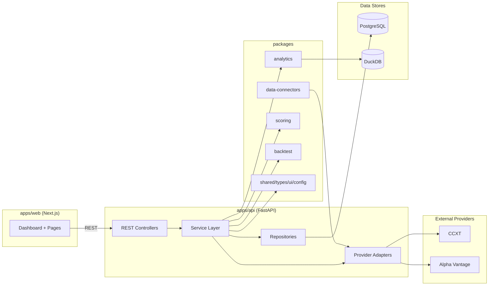

# Trading Analyst Monorepo Architecture

## High-level
- `apps/web`: Next.js frontend for dashboards, analysis views, and workflows.
- `apps/api`: FastAPI backend with versioned REST API (`/api/v1`), service layer, and adapters.
- `packages/*`: reusable modules (UI, shared types, analytics logic, scoring, backtest, provider connectors).
- `db`: PostgreSQL migrations and DuckDB workspace.
- `infra`: containerization and automation scripts.
- `docs`: architecture, risks, schema, and phased plan.

## Service boundaries
- Web app handles presentation and authenticated user workflows.
- API app handles orchestration, validation, and response contracts.
- Domain services handle market ingestion, analysis, scoring, news/context, paper trading, and backtest execution.
- Repositories isolate persistence details from business logic.
- Adapters isolate external providers (CCXT, Alpha Vantage, future paid providers).

## Module map

## Key patterns
- Adapter pattern for providers and news/market sources.
- Service layer between API endpoints and repositories.
- Repository pattern for PostgreSQL and DuckDB interactions.
- Event-style background jobs for ingestion and scoring refreshes.
- Strong contracts: Pydantic models in backend + TypeScript shared interfaces in frontend.
